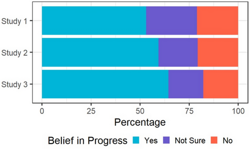
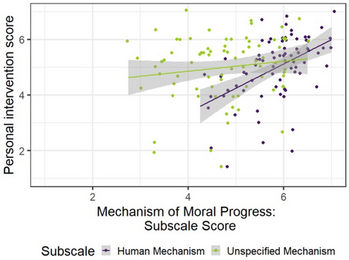

This is the outline of the Data Exercise 2 we will do in class together. Your Assignment 3 will be a direct extension/continuation of this in class activity. 

In your local repo for this class, create a new folder called "DataExercise2", or something like that. Move this file, the data file (Study1_data.csv), and the folder called "original_paper" into that new folder. Make sure to unzip "original_paper.zip" to turn it into a folder instead of a zip file. 

Change the name of this file so that "outline" is replaced with your last name and the author and date above are replaced with your name/today's date. 

# Introduction

We will be analyzing data from Study 1 of "Lay Theories of Moral Progress" by Casey Lewry, Sana Asifriyaz, and Tania Lombrozo at Princeton University, published in the journal "Cognitive Science" in November 2024.

**Paper**: https://doi-org.proxy.libraries.rutgers.edu/10.1111/cogs.70018

**Data and materials**: https://osf.io/wgkvr

**Original Abstract**:

Many consider the world to be morally better today than it was in the past and expect moral improvement to continue. How do people explain what drives this change? In this paper, we identify two ways people might think about how moral progress occurs: that it is driven by human action (i.e., if people did not actively work to make the world better, moral progress would not occur) or that it is driven by an unspecified mechanism (i.e., that our world is destined to morally improve, but without specifying a role for human action). In Study 1 (N = 147), we find that those who more strongly believe that the mechanism of moral progress is human action are more likely to believe their own intervention is warranted to correct a moral setback. In Study 2 (N = 145), we find that this translates to intended action: those who more strongly believe moral progress is driven by human action report that they would donate more money to correct a moral setback. In Study 3 (N = 297), participants generate their own explanations for why moral progress occurs. We find that participants’ donation intentions are predicted by whether their explanations state that human action drives moral progress. Together, these studies suggest that beliefs about the mechanisms of moral progress have important implications for engaging in social action.

# Set Up

First, we'll load libraries and the data. 

```{r}
library(tidyverse)
study1_data = read_csv("Study1_data.csv")
```

# Confirm Participants

Then, we'll confirm the number of participants from the paper. They report that Study 1 collected data from 150 adults, but only 147 passed the attention check. In the attention check, participants were asked to type the word “instructions” in a text box, and their response is recorded in the variable called `instructions`.

Can we see how many rows there are per particapnts to confirm this is in long form vs wide form?
```{r}
study1_data |>
  summarise(n_ids = n_distinct(id))
```

```{r}
study1_data |>
  count(id) |>
  filter(n != 1)
```

```{r}
study1_data |>
  filter(attention == "instructions") |>
  count() |>
  pull() # this just gives us the integer value instead of the whole table
```

```{r}
study1_data |> 
  distinct(attention)
```


After we confirm the number of subjects, let's create a new dataframe with only the included participants. 
```{r}
study1_included <- study1_data |>
  filter(attention == "instructions")
```

# Belief in Progress Plot

Figure 2 in the paper shows the proportion of participants who believe in moral progress for each experiment. The plot is below, and let's recreate this plot for Study 1. The relevant variable is `progress-belief`. For all future analyses, they only include participants who said "Yes" on this question, so let's create a new dataframe that only includes those participants. 



```{r}
study1_included |>
  filter(`progress-belief` == "Yes")
```

```{r}
study1_included |>
  group_by(`progress-belief`) |>
  summarise(n_responses = n())
```

```{r}
study1_included |>
  count(`progress-belief`)
```

```{r}
study1_included |>
  group_by(`progress-belief`) |>
  summarise(n_responses = n()) |>
  mutate(percentage = n_responses/sum(n_responses), 
         study = "Study 1") |>
  ggplot(aes(x = percentage, 
             y = study, 
             fill = `progress-belief`)) + 
  geom_bar(stat = "identity") + 
  labs(x = "Percentage", y = "", 
       fill = "Belief in Progress") + 
  theme_bw() + 
  theme(legend.position = "bottom")
  
```

Now we will restrict the data further to just the "yes" people
```{r}
study1_included_yes <- study1_included |>
  filter(`progress-belief` == "Yes")
```

```{r}
nrow(study1_included_yes)
```


# Verify Descriptive Statistics

For the primary analysis they report three measures: 

1. The Human Mechanism subscale, which is a mean of four items on a scale about their belief that humans drive moral progress, `humanprogress.mean` (M = 5.86, SD = 0.65)
2. Unspecified Mechanism subscale, which is a mean of four items on a scale about their belief that other things drive moral progress, `inevitableprogress.mean` (M = 4.77, SD = 0.92)
3. Personal Intervention scale, which was a mean of four items on a scale about their belief in various things *they* needed to do to correct moral setbacks, `humanintervention-mean` (M = 5.00, SD = 1.15)

Let's calculate the mean and standard deviation of each scale, to verify the numbers reported in the manuscript. There are lots of ways to do this, but let's try to do it by calculating the mean and standard deviation of all three measures at one time. 

```{r}
study1_included_yes |>
  summarise(mean_humanprogress = mean(humanprogress.mean), 
            sd_humanprogress = sd(humanprogress.mean))
```

```{r}
study1_included_yes |>
  select(id, humanprogress.mean, inevitableprogress.mean, `humanintervention-mean`) |>
  pivot_longer(c(humanprogress.mean, inevitableprogress.mean, `humanintervention-mean`)) |>
  group_by(name) |>
  summarise(M = mean(value),
            SD = sd(value))
```


# Create Scatterplot

Finallly we will (approximately*) recreate the scatterplot reported in Figure 3, which shows the relation between Personal Intervention and beliefs about progress, separated for human mechanisms and unspecified mechanisms. 

*note: this is only approximate between we will use `smooth()`, which looks at each variable separately. But, they report the regression lines from the joint regression, which will be slightly different. 




```{r}
study1_included_yes |>
  ggplot(aes(y = `humanintervention-mean`, 
             x = value #score for moral progress mechanism for both,.
             color = # type of moral progress 
               ))
  geom_point()
  geom_smooth(method = 'lm')
```

# Let's save as an html

Now, let's save this file as an HTML file and see what it looks like. 


